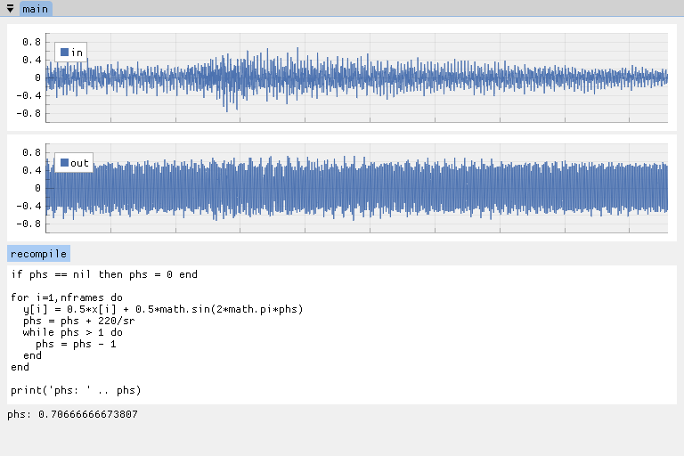

luart
=====

A template project for fast DSP prototyping, with Lua
scripting (à la REAPER's JesuSonic but I can still add
C parts), imgui, and implot, and JACK.

A work in progress. Only tested on UNIX.

Note
----

Don't use in production. Lua is still slow and the
inter-thread communications here prefer simplicity rather
than safety.

Lua scripting
-------------

The following global variables can be accessed in Lua

    sr: sampling rate
    nframes: number of frames to process
    x: input samples (array/table)
    y: output samples (array/table)

For example, the following code mixes a 220 Hz sine wave and
input, then prints the current phase of the sine generator:

    if phs == nil then phs = 0 end

    for i=1,nframes do
      y[i] = 0.5*x[i] + 0.5*math.sin(2*math.pi*phs)
      phs = phs + 220/sr
      while phs > 1 do
        phs = phs - 1
      end
    end

    print('phs: ' .. phs)

For above code, the processing loop takes around 20-80 us
when nframes=128, with Lua's incremental GC enabled.

Dependencies
------------

Make sure git, CMake, Ninja, JACK, GLFW, luajit are
installed on your system. ImGui and ImPlot will be fetched
and patched automatically by CMake using FetchContent.

On Arch Linux,

    $ pacman -S git cmake jack2 glfw luajit ninja

On macOS,

    $ brew install git cmake jack glfw luajit ninja

Build (Linux/macOS)
-------------------

Run

    $ make

to build the project and

    $ make run

to run the application.
